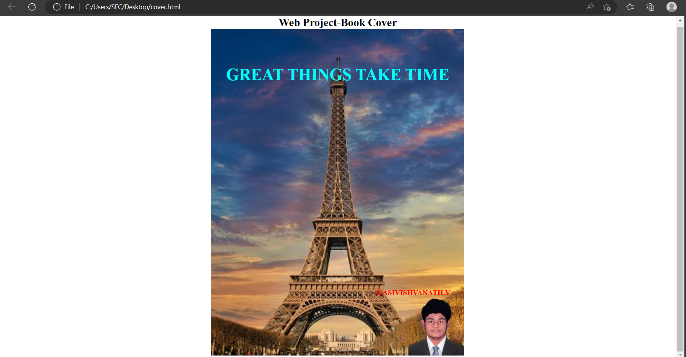

# Ex-06-Book-Cover-Design

## PROGRAM:
```
<html>
<head>
<meta charset="utf-8">
<title>Book Cover</title>
<style type="text/css">
.back-img{
background-image: url(picsart.jpg);
width:550px;
height:710px;
margin-left:auto;
margin-right: auto;

background-size:cover;


}
.text{

color:cyan;
font-family:Anton;
font-weight:bold;
font-size:large;
text-align:center;
positon:relative;
padding-top: 55px;

}

.foot{
    color:rgb(255, 0, 0);
    font-family:Anton;
    padding-top: 420px;
    padding-right: 30px;
    text-align:end;
    font-weight:bold;
    font-size:medium;
}
.text1{

color:rgb(0, 0, 0);
font-family:Anton;
font-weight:bold;
font-size:x-large;
text-align:center;
positon:relative;
}

</style>
</head>
<body>
<div class="text1">Web Project-Book Cover </div>
<div class="back-img">
<div class="text">
 <h1>GREAT THINGS TAKE TIME</h1>
 <h1></h1>
 <footer class="foot">-KASIVISHVANATH.V</footer>
</div>

</div>


</body>
</html>
```

## OUTPUT:

